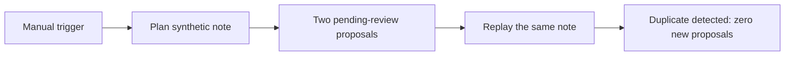

# Review-first notes workflow for n8n

**Turn a note into reviewable actions without creating duplicates on replay.**

This small work sample demonstrates a dependable automation pattern: an n8n
workflow calls a local planning API, receives a task and an email draft for
review, then replays the same input to demonstrate duplicate suppression.



## What it demonstrates

- **Review before action:** proposals carry `pending_review` and
  `autoExecute: false`; no email or calendar action is performed.
- **Replay protection:** a repeated note produces no additional proposals;
  changed text under the same note ID is an explicit conflict.
- **Recoverable failures:** an unavailable fixture model does not mark the
  note as processed, so a later valid response can be retried.
- **Operational controls:** disabled mode, bounded inputs, structured errors
  and a private in-memory ledger.
- **Inspectable implementation:** ordinary n8n Manual Trigger/HTTP Request
  nodes, a dependency-free Node.js API and automated tests.

## Lead-capture and CRM reliability example

[`examples/lead-capture/`](examples/lead-capture/) adds a separate synthetic
portfolio example for a multi-source lead workflow. It normalizes
Meta/web/WhatsApp-like fixture inputs, groups duplicate contacts
deterministically, produces CRM-ready preview records, and reports
first-response/SLA metrics. It is inactive, credential-free, makes no network
requests, and performs no CRM writes.

The example has 13 focused tests. Together with this repository's original
suite, **33/33 tests pass** on Node.js 22.15.0:

```sh
npm run test:all
```

## Try it

Use Node.js 22 or newer for the local wrapper:

```sh
node --test test/planner.test.mjs test/server.test.mjs
node src/server.mjs
```

In a local n8n instance on the same machine, import [`workflow.json`](workflow.json)
and run the inactive workflow manually. It calls only `127.0.0.1:8787`.
Start with a fresh wrapper process so its in-memory ledger is empty.

Inspect the two HTTP nodes individually:

| Node | Expected result |
| --- | --- |
| Plan fixture - pending review | `pending_review`, two proposals |
| Replay fixture - duplicate | `duplicate`, zero proposals |

Stop the wrapper with Ctrl+C. Restarting resets its demonstration ledger.
A cloud/container n8n instance does not share the host's loopback address.

## Verification

On September 24, 2026, **20/20 component tests passed on both Node.js 22.15.0
and 24.21.0**, including real local HTTP requests, replay/conflict handling,
invalid inputs, byte limits and timeouts.

**Also verified in n8n2.39.8:** the workflow was imported and executed
successfully through n8n's CLI. Its saved execution contains all three nodes:
two pending-review proposals on the first request, followed by a duplicate
result with zero proposals on replay.

See the [actual node outputs](docs/execution-result.json) and
[verification record](docs/verification.md). This is engine execution evidence,
not just a test that reads the workflow JSON.

The separate lead-capture example has component and workflow-fixture
verification, but has not been imported into the n8n engine. Its README states
that distinction explicitly.

## Files

- [`workflow.json`](workflow.json): the three-node n8n example.
- [`src/planner.mjs`](src/planner.mjs): review proposal and duplicate logic.
- [`src/server.mjs`](src/server.mjs): local HTTP API.
- [`test/`](test/): planner, API and workflow-fixture tests.
- [`docs/contract-and-limits.md`](docs/contract-and-limits.md): API contract
  and detailed operating assumptions.

## Scope

An original, AI-assisted portfolio demonstration using synthetic notes and
fixture model responses. It demonstrates orchestration and review planning,
not a live LLM or Google/Notion integration. The ledger is intentionally
in-memory; a production deployment would need durable state and an approval
interface. Use sample data and keep the API local.
